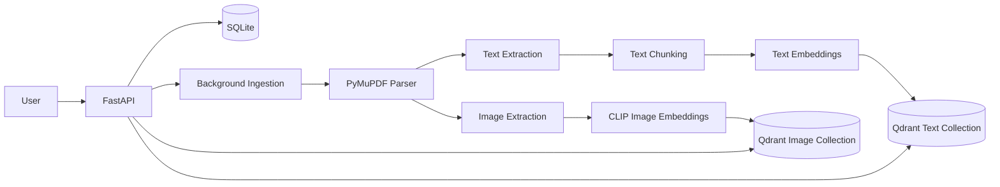

# OmniBrain

Agentic Multi-Modal RAG Orchestrator. This repository implements Week 1 only: a production-minded multimodal document-ingestion backend for PDFs

## Dataset

OmniBrain is designed as a Retrieval-Augmented Generation (RAG) system and therefore does not depend on a fixed machine learning dataset. Instead, it ingests and indexes user-provided PDF documents, creating a multimodal knowledge base for semantic retrieval.

For development, testing, and evaluation, the system utilizes publicly available corporate annual reports that contain a rich combination of textual content, financial tables, charts, and embedded images. These documents closely represent the real-world enterprise use cases targeted by the project.

**Representative documents include:**

* Microsoft Annual Report
* Apple Annual Report
* Alphabet (Google) Annual Report
* Amazon Annual Report
* NVIDIA Annual Report

During the ingestion pipeline, document text and embedded images are extracted, processed independently, and converted into vector embeddings. Text and image embeddings are stored in dedicated Qdrant collections, enabling efficient semantic retrieval and multimodal search with source-level citations.


## Week 1 Scope

Implemented:

- Asynchronous PDF upload through FastAPI BackgroundTasks.
- Page-level text extraction with PyMuPDF.
- Embedded raster image extraction with Pillow normalization to PNG.
- SQLite metadata for documents, pages, chunks, images, and ingestion events.
- Recursive page-scoped text chunking with overlap.
- Local text embeddings with `sentence-transformers/all-MiniLM-L6-v2`.
- CLIP image embeddings with `openai/clip-vit-base-patch32`.
- Separate Qdrant collections for text and image vectors.
- Text search, image search, and multimodal search endpoints.
- Structured errors, request IDs, tests, Docker, and local development commands.

Not implemented in Week 1: LangGraph agents, Text-to-SQL, Self-RAG, NeMo Guardrails, Langfuse, and the final Streamlit chat interface.

## Architecture



## Ingestion Workflow

1. `POST /api/v1/documents/upload` validates PDF MIME type, magic bytes, upload size, safe filename, and duplicate SHA-256 hash.
2. The PDF is saved under `data/uploads` with a UUID filename.
3. A document row is created with `queued` status and ingestion starts in a background task.
4. PyMuPDF extracts text page by page and marks empty pages as `requires_ocr`.
5. PyMuPDF extracts embedded images, Pillow converts them to PNG, tiny assets are ignored, and duplicate image hashes are tracked.
6. Text is split into overlapping page-scoped chunks.
7. Text chunks and images are embedded.
8. Vectors are stored in Qdrant with citation payloads.
9. Document status becomes `completed`, `partially_completed`, or `failed`.

## Search Workflows

Text search embeds the query with the text embedding provider and searches `omnibrain_text`.

Image search embeds the natural-language query with CLIP's text encoder and searches `omnibrain_images`.

Multimodal search runs both independently and returns separate result lists. Scores are not combined because text embeddings and CLIP embeddings live in different semantic spaces.

## Technology Choices

- FastAPI and Pydantic v2 for API validation.
- SQLAlchemy and SQLite for durable ingestion metadata.
- PyMuPDF for PDF text and image extraction.
- Sentence Transformers for local text embeddings.
- Transformers CLIP for image vectors and text-to-image search.
- Qdrant for cosine vector search.
- Ruff, Black, mypy, and pytest for quality gates.

## Why Separate Qdrant Collections

Text embeddings from `all-MiniLM-L6-v2` are 384-dimensional sentence vectors. CLIP image embeddings are 512-dimensional vectors in CLIP's multimodal space. These are incompatible dimensions and different semantic spaces, so OmniBrain stores them in separate Qdrant collections:

- `omnibrain_text`
- `omnibrain_images`

This keeps collection configuration simple, avoids invalid vector mixing, and prevents misleading cross-space ranking.

## Local Setup

```bash
cd omnibrain
python -m venv .venv
.venv\Scripts\activate
pip install -r requirements.txt
copy .env.example .env
```

Start Qdrant separately or use Docker Compose. For a local non-Docker API talking to Docker Qdrant, set:

```env
QDRANT_URL=http://localhost:6333
```

Run the API:

```bash
make run
```

Swagger is available at `http://localhost:8000/docs`.

For VS Code-specific run commands, see `VS_CODE_RUN.md`.

For teammate demo steps, observation checklists, experiments, and contribution workflow, see `TEAM_GUIDE.md`.

## Docker Setup

```bash
cd omnibrain
docker compose up --build
```

Exposed services:

- FastAPI: `http://localhost:8000`
- Qdrant HTTP: `http://localhost:6333`
- Qdrant gRPC: `localhost:6334`

## Environment Variables

See `.env.example`. Important values:

| Variable | Default | Description |
| --- | --- | --- |
| `DATABASE_URL` | `sqlite:///./data/omnibrain.db` | SQLite metadata database. |
| `QDRANT_URL` | `http://qdrant:6333` | Qdrant URL in Docker Compose. |
| `TEXT_EMBEDDING_MODEL` | `sentence-transformers/all-MiniLM-L6-v2` | Local text model. |
| `CLIP_MODEL` | `openai/clip-vit-base-patch32` | CLIP model. |
| `MAX_UPLOAD_SIZE_MB` | `50` | Upload size limit. |
| `TEXT_CHUNK_SIZE` | `800` | Approximate text chunk size. |
| `TEXT_CHUNK_OVERLAP` | `120` | Chunk overlap. |
| `MIN_IMAGE_WIDTH` | `150` | Tiny image filter width. |
| `MIN_IMAGE_HEIGHT` | `150` | Tiny image filter height. |
| `CORS_ALLOW_ORIGINS` | `http://localhost:8501` | Comma-separated allowed origins. |

## API Endpoints

### Health

- `GET /health`
- `GET /ready`

### Documents

- `POST /api/v1/documents/upload`
- `GET /api/v1/documents`
- `GET /api/v1/documents/{document_id}`
- `GET /api/v1/documents/{document_id}/status`
- `GET /api/v1/documents/{document_id}/events`
- `DELETE /api/v1/documents/{document_id}`

### Search

- `POST /api/v1/search/text`
- `POST /api/v1/search/images`
- `POST /api/v1/search/multimodal`

## curl Examples

Upload:

```bash
curl -X POST http://localhost:8000/api/v1/documents/upload \
  -F "file=@data/sample_documents/sample_report.pdf;type=application/pdf"
```

Example upload response:

```json
{
  "document_id": "uuid",
  "filename": "sample_report.pdf",
  "status": "queued",
  "message": "Document accepted for ingestion"
}
```

Status:

```bash
curl http://localhost:8000/api/v1/documents/{document_id}/status
```

Text search:

```bash
curl -X POST http://localhost:8000/api/v1/search/text \
  -H "Content-Type: application/json" \
  -d '{"query":"What were the main revenue drivers?","top_k":5,"document_id":null}'
```

Image search:

```bash
curl -X POST http://localhost:8000/api/v1/search/images \
  -H "Content-Type: application/json" \
  -d '{"query":"bar chart showing quarterly revenue growth","top_k":5,"document_id":null}'
```

Multimodal search:

```bash
curl -X POST http://localhost:8000/api/v1/search/multimodal \
  -H "Content-Type: application/json" \
  -d '{"query":"quarterly revenue growth","top_k":5,"document_id":null}'
```

Example text result:

```json
{
  "query": "What were the main revenue drivers?",
  "results": [
    {
      "score": 0.87,
      "document_id": "uuid",
      "document_name": "report.pdf",
      "page_number": 12,
      "chunk_id": "uuid",
      "chunk_index": 2,
      "text": "Enterprise subscriptions were the main revenue driver...",
      "content_type": "text",
      "citation": "report.pdf, page 12",
      "extraction_status": "extracted"
    }
  ]
}
```

Example image result:

```json
{
  "query": "chart showing profit growth",
  "results": [
    {
      "score": 0.82,
      "document_id": "uuid",
      "document_name": "report.pdf",
      "page_number": 7,
      "image_id": "uuid",
      "image_index": 1,
      "image_path": "data/extracted_images/uuid_page_7_image_1.png",
      "width": 1200,
      "height": 700,
      "content_type": "image",
      "citation": "report.pdf, page 7, image 1",
      "extraction_status": "extracted"
    }
  ]
}
```

## Tests and Quality

```bash
make test
make lint
make typecheck
```

Tests use generated PDF fixtures and mocks for expensive external dependencies. No paid APIs are required.

## Scripts

Generate a sample PDF:

```bash
python scripts/seed_sample.py
```

Reset local storage:

```bash
make reset
```

## Known Limitations

- OCR is intentionally not implemented in Week 1. Empty pages are marked `requires_ocr`.
- BackgroundTasks run inside the API process. The service boundaries are designed so Celery or Redis Queue can replace this later.
- Large embedding models are loaded lazily on first ingestion/search/readiness call.
- Image extraction targets embedded raster images, not vector drawings.
- There are no authentication or authorization layers yet.

## Week 2 Roadmap

- Add agentic orchestration after the ingestion backend is stable.
- Add richer retrieval evaluation and reranking.
- Add OCR for scanned pages.
- Add a Streamlit or web chat interface.
- Add observability with Langfuse once core retrieval is proven.

## Screenshots

Placeholder for Swagger, upload, status, and search screenshots.

## Troubleshooting

- If `/ready` reports Qdrant unavailable, confirm `docker compose ps` shows Qdrant healthy and `QDRANT_URL` matches your runtime.
- If ingestion is slow on first run, the local embedding and CLIP models are being downloaded and cached.
- If duplicate uploads return `409`, the file hash already exists in SQLite.
- If Docker builds are slow, PyTorch and transformer dependencies are the largest layers.
- If running locally outside Docker, set `QDRANT_URL=http://localhost:6333`.
